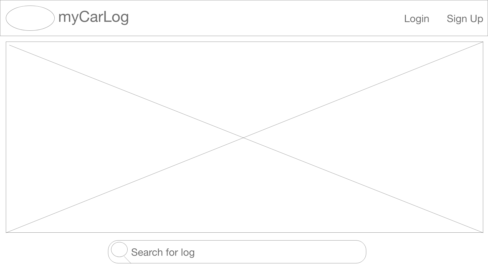
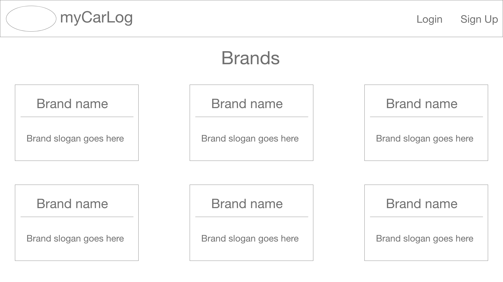
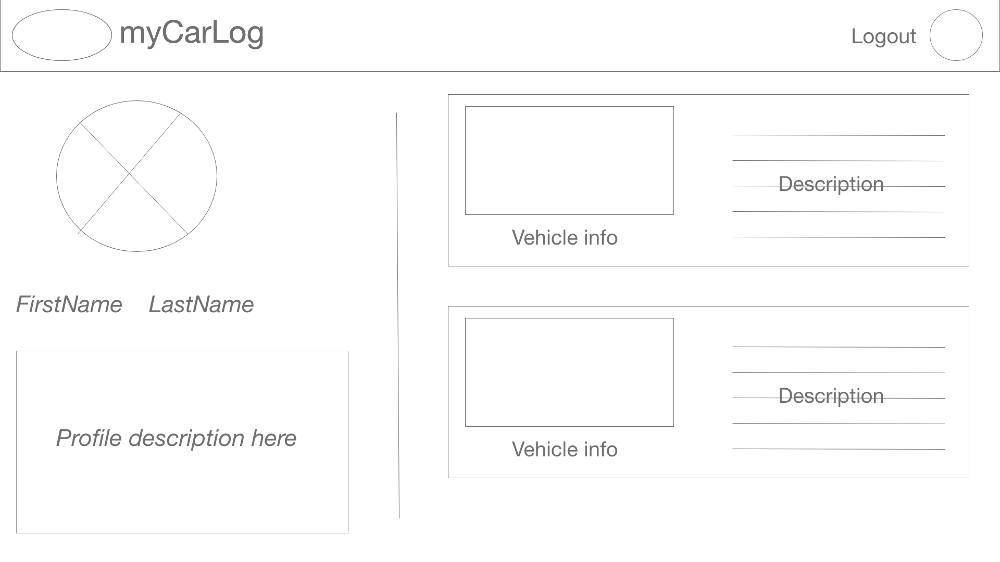
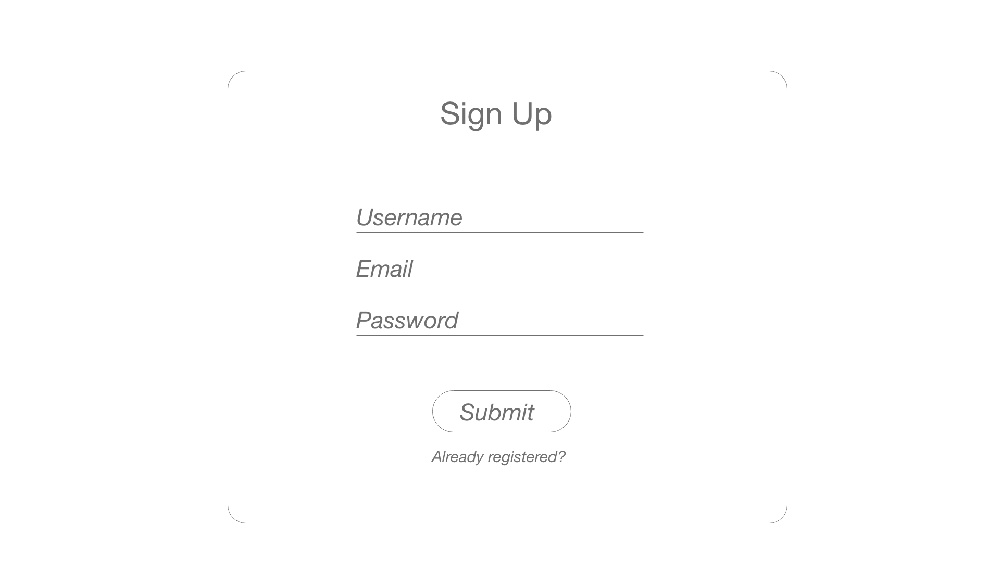
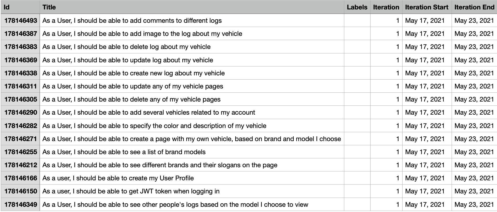
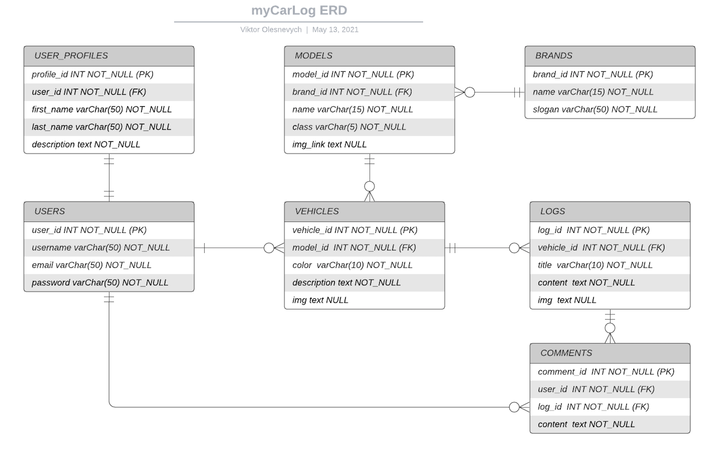
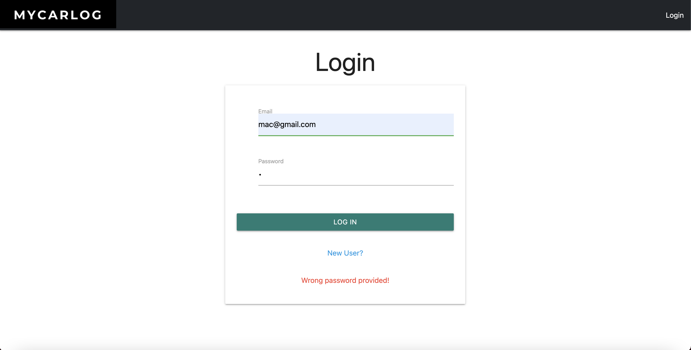
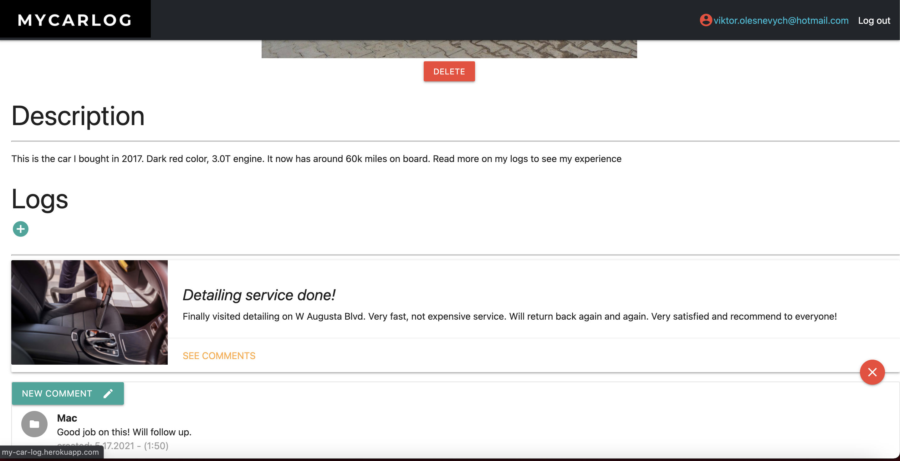

# MyCarLog

MyCarLog is an application which allows different users to share their experience about their cars. For example, user can share his story of fixing some technical error, upgrade of a car or just a regular story about his vehicle. I called this story - LOG and other users can also interact and leave comments on any logs. This is kind of a simple social media for car lovers, where the main heros are not real people but their cars.

## Links
[Back-end Repository](https://github.com/viktorolesnevych/my-car-log-backend) 
[Back-end Heroku](https://mycarlog.herokuapp.com/) 
[Front-end Heroku](http://my-car-log.herokuapp.com/) 
## Technologies used

#### Front-end
* HTML, CSS, JS, TS
* Angular
* Materialize CSS
#### Back-end
* Java, Spring Boot
* PostgreSQL

## Wireframes

## User-stories

## API Overview
### ER-Diagram

### Main Endpoints
| HTTP REQUEST | PATH | FUNCTIONALITY | Access |
| ------------ | ---- | ------------- | ------ |
| GET | /api/brands | Returns all brands | Public |
| GET | /api/brands/{brandId} | Returns single brand by id | Public |
| GET | /api/brands/name={brandName} | Returns a single brand by name | Public |
| GET | /api/brands/{brandId}/models | Returns models of brand | Public |
| GET | /api/brands/{brandId}/models/{id} | Returns a signle model of brand | Public |
| GET | /api/brands/name={brandName}/models/name={modelName} | Returns a signle model of brand by names| Public |
| GET | /api/vehicles/ | Returns all vehicles | Public |
| GET | /api/vehicles/{id} | Returns a single vehicle | Public |
| GET | /api/brands/{brandId}/models/{modelId}/vehicles | Returns all vehicles of specific model | Public |
| GET | /api/brands/{brandId}/models/{modelId}/vehicles/{id} | Returns single vehicle of specific model | Public |
| POST | /api/brands/{brandId}/models/{modelId}/vehicles | Creates a vehicle of specific model | JWT |
| PUT | /api/brands/{brandId}/models/{modelId}/vehicles/{id} | Updates single vehicle of specific model | JWT |
| DELETE | /api/brands/{brandId}/models/{modelId}/vehicles/{id} | Deletes single vehicle of specific model | JWT |
| GET | /api/vehicle/{id}/logs | Returns all logs of specific vehicle | Public |
| GET | /api/logs/{id} | Returns single log by id | Public |
| GET | /api/vehicle/{id}/logs/{logId} | Returns single log of specific vehicle | Public |
| POST | /api/vehicle/{id}/logs | Creates single log of specific vehicle | JWT |
| PUT | /api/vehicle/{id}/logs/{logId} | Updates single log of specific vehicle | JWT |
| DELETE | /api/vehicle/{id}/logs/{logId} | Deletes single log of specific vehicle | JWT |
| GET | /api/vehicles/{vehicleId}/logs/{logId}/comments | Returns all comments under a single log | Public |
| GET | /api/vehicles/{vehicleId}/logs/{logId}/comments/{commentId} | Returns single comment under a single log | Public |
| POST | /api/vehicles/{vehicleId}/logs/{logId}/comments | Creates single comment under a single log | JWT |
| PUT | /api/vehicles/{vehicleId}/logs/{logId}/comments/{commentId} | Updates single comment under a single log | JWT |
| DELETE | /api/vehicles/{vehicleId}/logs/{logId}/comments/{commentId} | Deletes single comment under a single log | JWT |
| POST | /auth/users/register | Registers a new user | Public |
| POST | /auth/users/login | Logs a user in | Public |
| GET | /auth/users/profile | Get user's profile | JWT | 
| GET | /auth/users | Get a list of users | Public |

---
## Screenshots

## Future ideas
* Being able to subscribe to different users and see their updates on the home page
* Send direct messages
* Upload files and photos to log
* Having likes and reaction features for logs
* Having email or phone notifier about actions on your log
